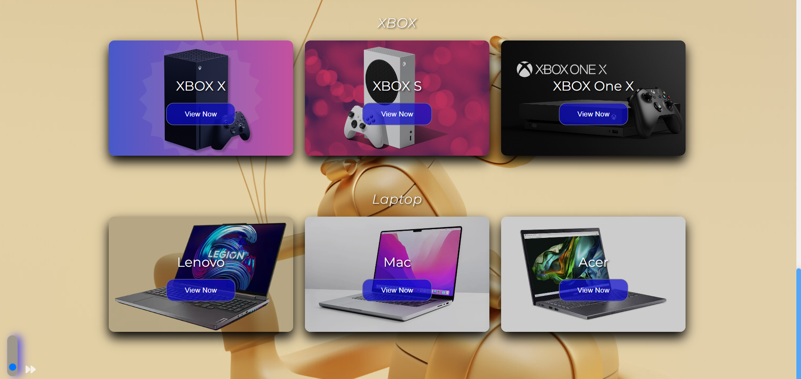

# __*GalaxyPlay*__
Welcome to __GalaxyPlay__! Initially conceived as a simple store for video games, consoles, laptops, computers, and electronics, we've evolved into a social network for gamers. In addition to accessing the GalaxyPlay store, __every user can chat with others in real-time and send pictures.__ Each registered user can __create posts__, such as video game reviews (with likes and comments). The GalaxyPlay Blog is where users can discover new games (not yet available in the GalaxyPlay store), find their new favorite game, and filter their searches by various criteria. Let's explore all the site's features in more detail below...

# Public Area

__*Discover Page*__ - a page accessible to all registered and unregistered users. At the top, there's a Live Wallpaper section that displays a different Live Wallpaper Video of a popular game with each page refresh, or allows users to change the wallpaper using the arrows (left or right). Further down, it showcases what benefits users would receive if they register.

